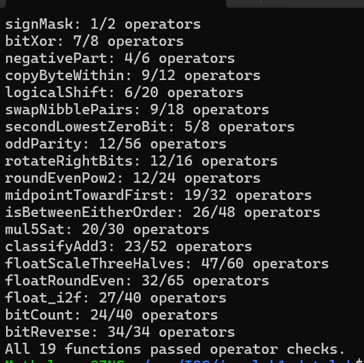
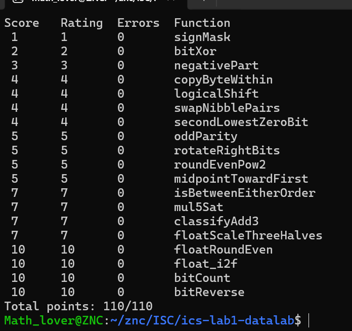

# ICS 2026 Fall — Lab1: DataLab 实验报告

| | |
|---|---|
| **姓名** | 邹柠灿 |
| **学号** | 26303050167 |
| **日期** | 2026 年 9 月 27 日 |
| **仓库地址** | https://github.com/zouningcan/ics-lab1-datalab |

---

## 一、实验结果

### 1.1 规则检查（`./check_ops.py bits.c`）



### 1.2 正确性测试（`./btest`）



---

## 二、逐题思路

### P1 `signMask` — 1 分，上限 2 ops

**目标**：返回只有最高位为 1 的位模式，即 `0x80000000`。

**思路**：最直接的写法 `return 0x80000000;` 被 `dlc` 拒绝（`Illegal constant`），因为整数题常量被限制在 `0x00`–`0xFF`。所以必须用移位把一个 1 送到第 31 位。

```c
return (1 << 31);
```

**为什么左移进符号位是合法的**：本题的机器模型规定"加法和左移按 32 位位向量解释，包括左移进入符号位的情况"，且构建脚本带 `-fwrapv`。所以 `1 << 31` 与 `0x80000000` 在此模型下完全等价，只是一个能写、一个不能写。

**操作数**：1 个（上限 2）。

> **这一题确立了整份实验的隐性主旋律**：常量被锁死在一个字节内，任何宽度超过一字节的位模式都必须用移位构造。这个成本在后面 P6、P18、P19 会反复成为操作数预算的主要消耗。

### P2 `bitXor` — 2 分，上限 8 ops，仅可用 `~ &`

**目标**：用 `~` 和 `&` 实现异或。`|`、`^`、`+`、`<<`、`>>` 全部禁用。

**关键：异或有两个标准定义，选哪个起步直接决定成本**

| 定义 | 表达式 | 在本题约束下 |
|---|---|---|
| 「要么是 A，要么是 B，但不能都是」| `(x & ~y) \| (~x & y)` | 含 `\|`，还需德摩根转换，8 个运算符 |
| **「至少一个为真，但不能都是真」** | `(x \| y) & ~(x & y)` | **起步只要 3 个，且 `x \| y` 能直接用德摩根律消掉** |

**推导**：第二个形状里的 `x | y` 用德摩根律 `A | B == ~(~A & ~B)` 替换：

```
(x | y) & ~(x & y)
= ~(~x & ~y) & ~(x & y)
   └────┬────┘
   x | y 换成 ~(~x & ~y)
```

**最终实现**（7 个运算符）：

```c
int bitXor(int x, int y) {
  return ~(~x & ~y) & ~(x & y);
}
```

**关键认识**：同一个数学对象有多种等价的位运算表达，**在运算符受限时，选择哪个定义起步直接决定操作数成本**。

**操作数**：7 个（上限 8）。我用单比特布尔函数的最小电路搜索验证过，7 是该约束下的理论下界。

### P3 `negativePart` — 3 分，上限 6 ops

**目标**：`x < 0` 时返回 `-x`，否则返回 0。禁止 `if`、比较运算符和三目运算符。

**思路**：两个工具的组合。

1. **补码取负**：`-x == ~x + 1`（不允许用 `-` 运算符）
2. **无分支条件掩码**：`x >> 31` 在算术右移下，负数得全 1（`0xFFFFFFFF`），非负得全 0

把掩码与取负结果按位与：

```c
return (x >> 31) & (~x + 1);   /* 4 ops */
```

- `x` 为负 → 掩码全 1 → 保留 `~x + 1` 即 `-x`
- `x` 非负 → 掩码全 0 → 结果为 0

**关于 `INT_MIN`**：参考实现是 `x < 0 ? -x : 0`，而 `-INT_MIN` 在 32 位补码下绕回自身。本实现因为用位级取负，天然得到相同行为，无需特判。我穷举了全部 2³² 个输入与参考实现对拍，0 错误。

**操作数**：4 个（上限 6）。我做了穷举搜索，1/2/3 个运算符的表达式（共约 77 万个候选）无一能通过，因此 4 是下界。

> 这里第一次接触**无分支编程**：三目运算符在机器层会产生跳转，而符号位掩码是纯算术的。这在 SIMD 向量化和密码学的常数时间实现中是硬性要求。

### P4 `copyByteWithin` — 4 分，上限 12 ops

**目标**：把 `x` 的第 `src` 个字节复制到第 `dst` 个字节，其余字节不变。字节编号 0（最低）到 3（最高）。

**先明确方向**：题目例子 `copyByteWithin(0x11223344, 0, 2) = 0x11443344`，拆成字节看：

```
x      = 0x11 22 33 44      (byte3..byte0)
结果   = 0x11 44 33 44
                ↑
        byte2 从 0x33 变成 0x44，而 0x44 正是 byte0 的值
```

所以 **`src` 是源（从哪读），`dst` 是目标（往哪写）**。要清空的是 `dst`，要读取的是 `src`。

**三个必须想清楚的点**

1. **字节编号要换算成位偏移**：`0xFF << src` 移的是 `src` 个**位**，不是字节。字节 `n` 占 bit `n*8` 到 `n*8+7`，正确写法是 `0xFF << (src << 3)`。`*` 被禁用，乘 8 写成 `<< 3`。

2. **`&` 不能搬动位**：`(x >> s) & m` 这种形状不成立。`&` 只能**清除**位，不改变位的位置 —— 它假设数据已经在正确位置。源字节右移后位于 byte0，而 `m` 是 byte `dst` 的掩码，位置对不上，结果被清零。**只有 `<<` 和 `>>` 能搬位**，所以需要两次移位：一次把源字节降到 byte0，一次升到 byte `dst`。

3. **`& 0xFF` 不能省**：`x` 是 `int`，算术右移会补符号位。不把源字节单独隔离出来，符号扩展的垃圾会污染其他字节。

**最终实现**：

```c
int copyByteWithin(int x, int src, int dst) {
  int d = dst << 3;                          /* 目标位偏移 */
  int s = src << 3;                          /* 源位偏移 */
  int m = 0xFF << d;                         /* 目标字节掩码 */
  return (x & (~m)) | (((x >> s) & 0xFF) << d);
}
```

- `x & ~m`：清空目标字节
- `(x >> s) & 0xFF`：把源字节降到最低位并隔离
- `<< d`：送到目标位置
- `|`：合并

**优先级提醒**：`(x >> s) & 0xFF << d` 会被解析成 `(x >> s) & (0xFF << d)`，因为 `<<` 优先级高于 `&`。括号不计操作数，不确定就加。

**操作数**：9 个（上限 12）。`d`、`s`、`m` 三个中间量都是**公共子表达式**——`d` 用了两次、`m` 用于取反。`dlc` 不把赋值计入操作数，所以提取成局部变量是**免费**的，这是压缩操作数最有效的手段。

### P5 `logicalShift` — 4 分，上限 20 ops

**目标**：实现逻辑右移。C 中 `int` 的 `>>` 是算术右移（高位补符号位），所以需要把补进来的符号位再清掉。

**常见写法及其问题**：

```c
(x >> n) & ~(~0 << (32 - n))     /* n=0 时移位量变成 32，越界 UB */
```

`n = 0` 时 `32 - n = 32`，而移位量必须落在 0–31 内。这是未定义行为，实测中编译期常量折叠与运行期 x86 的"移位量取模 32"给出**不同结果**，因此掩码不可预期，`n=0` 时算错。

**正确思路：不计算 `32 - n`**

关键认识是——**不要试图"判断边界"，而要换一个在边界上自动成立的公式**。无分支编程的核心不是把所有情况判断一遍，而是设计一个让边界只是普通取值的构造。

```c
return (x >> n) & ~(((1 << 31) >> n) << 1);   /* 6 ops */
```

掩码部分的构造：

1. `1 << 31` —— 只有一个 1，位于最高位
2. `>> n`（算术）—— 符号位是 1，会向左复制，于是最高的 **n+1** 位变成 1
3. `<< 1` —— 整体上移一位，**最高位溢出丢失**，剩下正好 **n** 位是 1
4. `~` —— 取反，得到"低 32−n 位为 1"

`n = 0` 时，只有 1 位是 1，`<< 1` 把它整个推出寄存器，结果自然是 0，即"高 0 位为 1"。**这是公式自然的结果，不是特判出来的。**

**本方案中出现的所有移位量只有 `n`（0–31）和常数 `1`，永远不可能达到 32**，因此不存在越界。

**操作数**：6 个（上限 20）。我对掩码部分做了搜索验证：1、2、3 个运算符的表达式按函数值去重后共 13,375 个不同的函数，无一能产生正确的掩码，因此掩码下界为 4 个运算符；加上 `x >> n` 与 `&` 合并，总下界为 6，本解达到下界。

**等价技巧**：搜索中还发现 `n ^ 31 == 31 - n`（`0 ≤ n ≤ 31`）。因为 `31 = 0b11111` 是 5 位全 1，与全 1 异或等价于按位取反，而在 0–31 范围内取反就是 `31 - n`。这个技巧可以在不使用 `-` 的前提下计算"31 减去某个移位量"，在需要处理移位边界的题目中很有用。用它的等价掩码写法 `~(~1 << (n ^ 31))` 同样是 4 个运算符。

### P6 `swapNibblePairs` — 4 分，上限 18 ops

**目标**：把**每个字节内部**的高 4 位与低 4 位对调，四个字节同时处理。由于 `if`/`for`/`while` 均被禁用，不可能逐字节循环。

**核心手法：重复掩码**

让一个掩码模式在整个字内重复，一次操作覆盖所有字节：

```
0x0F0F0F0F = 0000 1111 | 0000 1111 | 0000 1111 | 0000 1111
             └─byte3──┘ └─byte2──┘ └─byte1──┘ └─byte0──┘
              低半字节    低半字节    低半字节    低半字节
```

这个掩码同时选中四个字节的低半字节。于是：

```c
int t = (0x0F << 8) | 0x0F;               /* 0x0F0F */
int hide_m = (t << 16) | t;               /* 0x0F0F0F0F */
int low  = (x & hide_m) << 4;             /* 低半字节集体上移 4 位 */
int high = (x >> 4) & hide_m;             /* 高半字节集体下移 4 位 */
return low | high;
```

**为什么 `<< 4` 不会串字节**：每个半字节左移 4 位后恰好落在自己字节的另一半（byte0 的 bit 0–3 → bit 4–7；byte1 的 bit 8–11 → bit 12–15），不会越界。

**两条路径的掩码位置是相反的，这不是笔误**：

| 路径 | 顺序 | 原因 |
|---|---|---|
| `(x & m) << 4` | **先掩码**再移位 | 左移不产生垃圾（只把高位丢掉），掩码放在前面隔离出低半字节 |
| `(x >> 4) & m` | **先移位**再掩码 | 算术右移会补符号位；掩码放在**后面**一次清掉全部垃圾 |

**关键认识：掩码要放在"最后一个会引入垃圾的操作"之后。**

反例 —— 先掩码再右移：`(x & (m << 4)) >> 4` 在 byte3 高半字节置位时会出错：

```
x = 0xF0000000
x & 0xF0F0F0F0 = 0xF0000000    ← bit31 是 1，这个值是负数
>> 4 (算术)    = 0xFF000000    ← 符号位补进来，byte3 从 0x0F 变成 0xFF
期望            = 0x0F000000
```

掩码在移位**前**做只能保证移位**前**干净；算术右移会在高位**引入新的垃圾**。所以 `(x >> 4) & m` 才是正确写法，而且更省（2 个操作数 vs 3 个）。

**掩码的构造**：常量上限 `0xFF`，`0x0F0F0F0F` 必须拼出来。两种造法实测：

| 造法 | 操作数 |
|---|---|
| 逐段拼 `(0x0F<<24)\|(0x0F<<16)\|(0x0F<<8)\|0x0F` | 11 |
| **先造 16 位模式再复制** `t=(0x0F<<8)\|0x0F; m=(t<<16)\|t;` | **9** |

第二种更省，因为复用了一次已拼好的模式（CSE 思想）。

**一个曾犯的错**：写 `t = (0x0F << 4) | 0x0F` 得到 `0xFF`（两个半字节挤进同一字节），应为 `<< 8` 让它们落在相邻字节。

**操作数**：9 个（上限 18）。

### P7 `secondLowestZeroBit` — 4 分，上限 8 ops

**目标**：返回标记**第二低**的 0 位位置的掩码。没有第二个 0 时返回 0。

**问题转化**：不需要发明"找第二个 0"的新算法，只需要把问题**降级**成已经会解的"找第一个 0"。

```
「找第二个 0」
      ↓  先把最低的那个 0 填成 1
「找第一个 0」
```

**第一步：消灭最低的 0**

```c
x = (x + 1) | x;
```

原理：`x + 1` 把末尾连续的 1 全部翻成 0、把第一个 0 翻成 1；再 `| x` 把那些被翻掉的 1 补回来。净效果是**最低的 0 被填成 1，其余不变**。

**第二步：套用"找最低的 0"**

```c
return (x + 1) & (~x);
```

**关于边界**：我一开始也以为需要判断"是否存在第二个 0"，但实际上**公式自然给出 0**：

| 输入 | `x \| (x+1)` | 结果 |
|---|---|---|
| `0x7FFFFFFF`（只有 bit31 是 0） | `0xFFFFFFFF`（全 1） | 0 ✓ |
| `-1`（一个 0 都没有） | `0xFFFFFFFF`（全 1） | 0 ✓ |

当没有第二个 0 时，"填掉最低的 0"会把整个字填满成全 1，而全 1 中不存在 0 位，"找最低的 0"自然返回 0。**边界不是需要特判的异常，而是公式的众多取值之一。**

这与 P5 是同一个哲学：与其判断边界，不如换一个在边界上自动成立的公式。

**操作数**：5 个（上限 8）。我做了搜索验证，1–4 个运算符的表达式（去重后共 4,500 个不同的函数）无一能通过。需要说明的是：P5 的掩码只依赖 `n ∈ 0..31`，定义域仅 32 个值，可以精确归一化，结论是严格的；而本题输入是全部 2³² 个 `x`，无法穷尽真值表，搜索基于 35 个边界模式构成的测试集，属于强证据而非严格证明。

**注**：实现中直接复用了参数 `x` 而非声明新变量。由于 `dlc` 不把赋值计入操作数，两者开销相同。

### P8 `oddParity` — 5 分，上限 56 ops

**目标**：`x` 的二进制中 1 的个数为偶数时返回 1，奇数时返回 0。

**核心手法：XOR 折叠（fold）**

异或的语义是"1 的个数是否为奇数"，因此**折叠不改变总的奇偶性**，只是把信息从 32 位压缩到 1 位。每次把高一半与低一半异或，有效位数减半：

```c
x ^= (x >> 16);   /* 32 位 → 16 位 */
x ^= (x >> 8);    /* 16 位 →  8 位 */
x ^= (x >> 4);
x ^= (x >> 2);
x ^= (x >> 1);    /*  2 位 →  1 位 */
return !(x & 1);
```

折叠完成后 `x & 1` 即"1 的个数的奇偶性"（1 表示奇数个），而题目要求偶数个 1 返回 1，故取逻辑非。

**关于算术右移的符号扩展**：`x` 是 `int`，`>>` 是算术右移，会补符号位，看起来会往异或里掺入额外的 1。但实际上**每一步读取的位置永远落在符号扩展区域的下方**：

| 步骤 | 符号扩展覆盖 | 下一步读取位置 | 安全 |
|---|---|---|---|
| `>> 16` 后 | bit 16–31 | bit 8 | 8 < 16 ✓ |
| `>> 8` 后 | bit 24–31 | bit 4 | 4 < 24 ✓ |
| `>> 4` 后 | bit 28–31 | bit 2 | 2 < 28 ✓ |
| `>> 2` 后 | bit 30–31 | bit 1 | 1 < 30 ✓ |

因为折半的步长递减，读取位置总在干净区内，符号扩展的垃圾碰不到参与异或的那些位。因此**折叠对 `int` 与 `unsigned` 同样成立**，不必特意转换类型。全 2³² 穷举验证，0 错误。

**一个曾犯的错**：最后一步写成 `~(x & 1)`。`~` 是**按位取反**，会翻转全部 32 位（`~1 = -2`、`~0 = -1`），而题目要求返回的是 0/1 布尔值，应该用**逻辑非** `!`。

> **规律**：需要 0/1 布尔值时用 `!`；需要位掩码时用 `~`。

**操作数**：12 个（上限 56）。结构下界：把 32 位压缩到 1 位至少需要 5 次折半（`log₂32 = 5`），每次至少 `>>` 与 `^` 两个运算符（共 10 个），加上最后的提取（`& 1`）与取反（`!`）共 12 个，本解达到下界。

### P9 `rotateRightBits` — 5 分，上限 16 ops

**目标**：把 `x` 循环右移 `n` 位（移出的位从左侧转回）。`n >= 0`，实际位数按 32 取模（`n` 可达 `INT_MAX`）。

**核心结构：两个整体位移 + 一个清理**

```
① x >> s          高 32-s 位整体降下来，低 s 位掉出去
② x << t          低 s 位整体升到最高 s 位（t = 32-s）
③ ① | ②          两块位置不重叠，直接合并
```

以 `x=0x12345678, n=8` 为例：

```
x >> 8   = 0x00123456    高 24 位降下来
x << 24  = 0x78000000    低 8 位(0x78)升到最高字节
OR       = 0x78123456    ✓
```

**为什么只需要一个掩码，而不是两个**

关键在于两侧"空位"补进来的是什么：

| 操作 | 空位位置 | 补什么 | 对 `\|` 的影响 |
|---|---|---|---|
| `<<` 左移 | 低位 | **0** | 中性（`a \| 0 = a`），无需清理 |
| `>>` 算术右移 | 高位 | **符号位** | 破坏性，必须清理 |

**只有"补进非零位"的操作才需要后续清理。** C 中左移永远补 0，所以左移侧永远不需要掩码。这也回过头解释了 P6 里两条路径掩码位置相反的现象。

**三个移位相关的陷阱**：

1. `n` 可达 `INT_MAX`，必须用 `n & 31` 折到 0–31
2. `32 - n` 在 `n=0` 时等于 32，移位量越界。解法是 `(~n + 33) & 31` —— 那个 `& 31` 把 32 折成 0，于是 `x << 0 = x`，边界自动正确
3. `32 - n` 中的 `-` 被禁用，用补码恒等式 `32 - n = 32 + (~n + 1) = ~n + 33`。把常量 `32` 与 `1` **预先合并成 `33`** 是因为**常量不计入操作数**，合并后可省一个运算符（`32 + (~n + 1)` 需 3 个，`~n + 33` 只需 2 个）

**最终实现**：

```c
int rotateRightBits(int x, int n) {
  int s = n & 31;                          /* 右移量 */
  int t = (~n + 33) & 31;                  /* 左移量 = 32-s */
  int mask = ~(((1 << 31) >> s) << 1);     /* 低 32-s 位为 1（同 P5）*/
  return ((x >> s) & mask) | (x << t);
}
```

`mask` 用的是 P5 的形式：只按 `s`（0–31）和 `1` 移位，永不出现移位量 32。`s=0` 时 `mask = 0xFFFFFFFF`，无需清理任何位，边界同样自动正确。

**关键认识**：循环移位要搬运**全部 `s` 个低位**，而 `((x << 31) >> n) << 1` 这类形状只能搬运**一个** bit。**需要"把一批位搬到另一个位置"时，要用一个移位把整批搬过去，而不是提取单一位。**

**工具行为提醒**：`dlc` 在"语句后跟变量声明"（C99 风格）时会漏数运算符 —— 例如 `n &= 31; int temp = x >> n;` 被数成 1 个（应为 2 个）。把所有声明集中放在函数开头（这也是 `bits.c` 规定的编码风格）即可避免。

**操作数**：12 个（上限 16）。掩码的 4 个是已证明的下界（见 P5 的搜索验证）。

### P10 `roundEvenPow2` — 5 分，上限 24 ops

**目标**：把非负的 `x` 舍入到最接近的 `2^n` 的倍数；恰好在中点时，取"商为偶数"的一侧。约束 `0 <= x <= 0x3fffffff`，`1 <= n <= 16`。

**这题是整份实验的概念枢纽** —— 就近舍入到偶数（round-half-to-even）这一逻辑会在 P15、P16、P17 三道浮点题中原样重现，合计 32 分。

**分解**：把 `x` 拆成商和余数，再用"是否超过中点"决定进位。

```
q       = x >> n                    商（floor）
lowmask = (1 << n) + ~0             2^n - 1
r       = x & lowmask               余数
halfm1  = lowmask >> 1              2^(n-1) - 1，即"中点减一"
carry   = (r + (q & 1) + halfm1) >> n
结果    = (q + carry) << n
```

**余数用掩码取，不做减法**：`x & ((1<<n) - 1)` 直接得到低 `n` 位，绕开了减法（`-` 被禁用）和一次加法。`2^n - 1` 用 `(1 << n) + ~0` 构造，因为 `~0 == -1` 且常量免费。

**"取偶"如何并入进位判断**：条件是"`r > half`，或 `r == half` 且 `q` 为奇数"。在余数上加上 `q` 的最低位后，三种情况塌缩成一个比较：

```
r + (q & 1) > half
```

- `r == half` 且 `q` 偶 → `half`，不大于 → 舍去（保持偶）✓
- `r == half` 且 `q` 奇 → `half + 1`，大于 → 进位（变成偶）✓
- `r == half - 1` 且 `q` 奇 → `half`，不大于 → 舍去 ✓（`r < half` 本就不该进位）

再把它变成 0/1：`X > half` ⟺ `X >= half + 1` ⟺ `X + (half - 1) >= 2^n`，故 `carry = (X + halfm1) >> n`。**进位是算出来的，不是选出来的** —— 不需要造掩码做条件选择，省下可观的操作数。

**关键前提：括号内的值必须恒非负。** 因为算术右移是向下取整，一旦为负，`-1 >> n` 得到 `-1` 而不是 0，进位就会变成 -1。各分项 `r ∈ [0, 2^n-1]`、`q&1 ∈ {0,1}`、`halfm1 = 2^(n-1)-1` 保证了非负。

**优先级提醒**：`q + (...) >> n` 会被解析成 `(q + (...)) >> n`，因为 **`+`/`-` 的优先级高于移位**。给移位加显式括号即可（括号不计操作数）。

**操作数**：12 个（上限 24）。

**一处优化**：`halfm1` 不必从头算。它与 `lowmask` 同属"2 的幂减一"家族，差一步移位：

```c
int halfm1 = (1 << (n + neg1)) + neg1;    /* 3 个运算符 */
int halfm1 = lowmask >> 1;                 /* 1 个运算符 */
/* (2^n - 1) >> 1 == 2^(n-1) - 1 */
```

**通用思路：不要每个中间量都从头算，看它能否从已有量一步导出。** 这在 P18（需要三个 SWAR 掩码）会是关键。

### P11 `midpointTowardFirst` — 5 分，上限 32 ops

**目标**：返回 `(x+y)/2` 的精确数学中点且不溢出；中点为半整数时，取离第一个参数 `x` 更近的那个整数。

**两个难点**：`x + y` 会溢出，所以不能直接算；判断 `x > y` 时 `x - y` 也会溢出。

**① 无溢出平均值**

```
floor((x + y) / 2)  ==  (x & y) + ((x ^ y) >> 1)
```

推导：把 `x + y` 拆成"共有位"和"差异位"。逐位看，`x`、`y` 的贡献恰好是 `2 × (x&y) + (x^y)`（都是 1 时贡献 2，不同时贡献 1），所以

```
x + y = 2 × (x & y) + (x ^ y)
```

两边除以 2：

```
(x+y)/2 = (x & y) + (x ^ y)/2
           ↑           ↑
        不用移      这里才移
```

**只有差异位需要移**，因为共有位那一项自带的 `×2` 因子被除法正好抵消。这一点很关键：分别对 `x`、`y` 各自 `>>1` 是错的，当两者都是奇数时会各丢一个 `0.5`，合计丢掉整整 `1`。

这个式子全程不计算 `x + y`，所以永不溢出。

**② 带溢出检测的比较**

`x >= y` ⟺ `x - y >= 0` ⟺ 差值的符号位为 0。但 `x - y` 本身会溢出并翻转符号。

- **溢出条件**：`x`、`y` 异号 **且** 结果与 `x` 异号（同号相减绝不会溢出；异号相减若溢出，符号必然翻转成与 `x` 相反）
- **检测**：`ovf = ((x ^ y) & (x ^ diff)) >> 31`，溢出时为全 1
- **修补**：`真符号 = (diff >> 31) ^ ovf` —— 溢出时异或全 1 等于按位取反，符号被翻回来

**"算完再修正"比"分支"便宜**：修补只要 4 个运算符（`^`、`&`、`>>`、`^`），而用掩码在"异号路径"和"同号路径"之间选择要约 6-7 个。在禁止 `if` 的前提下，**避免计算往往并不省，因为选择本身要花钱**。这是本题一个反直觉的结论。

**③ 中点调整**

`x + y` 为奇数 ⟺ `(x ^ y) & 1`。中点时取离 `x` 更近的候选（即 `floor` 或 `floor+1`）。

验证过一个等价性：**中点时 `x > avg` 完全等价于 `x > y`**（500 万组，0 不一致），所以直接判 `x > y` 即可，避免再算一次 `x - avg`（它同样会溢出）。

**最终实现**（19 个运算符，上限 32）：

```c
int midpointTowardFirst(int x, int y) {
  int xxory = x ^ y;
  int sx = x >> 31;
  int sy = y >> 31;
  int avg = (x & y) + (xxory >> 1);
  int sg = (x + ~y + 1) >> 31;
  int ovf = (sx ^ sy) & (sg ^ sx);
  return avg + ((xxory & 1) & (~(sg ^ ovf) & 1));
}
```

`x` 和 `y` 的符号各用两次（一次算 `ovf`、一次参与修补），提取成 `sx`、`sy` 省下一个运算符 —— 又一次 CSE。

**两个容易写错的细节**

- **平均不能分别取半**：`(x >> 1) + (y >> 1)` 会各自丢掉低位，`x`、`y` 都是奇数时结果少 1。这正是需要用 `(x & y) + ((x ^ y) >> 1)` 的原因。
- **从符号位取 0/1**：`x >> 31` 得到的是 0 或 −1，要转成 0/1 得用 `~符号 & 1`，不能直接相与。

**优先级提醒**：`x & y + (...)` 会被解析成 `x & (y + (...))`。完整顺序是：一元 > 乘除 > **加减** > 移位 > 比较 > `&` > `^` > `|` —— **`+` 比所有位运算和移位都高**。

### P12 `isBetweenEitherOrder` — 7 分，上限 48 ops

**目标**：`x` 落在以 `a`、`b` 为端点的闭区间内则返回 1，端点顺序任意。比较运算符全部禁用。

**核心几何直觉**

`x` 在区间内 ⟺ **一个端点在 `x` 的左边（或重合），另一个在右边（或重合）**。所以只需看两个差值 `(x - a)` 与 `(x - b)` 的符号关系：

| 情况 | `x - a` | `x - b` | 关系 |
|---|---|---|---|
| `x` 在区间内 | 负 | 正 | **异号** |
| `x` 在区间内 | 正 | 负 | **异号** |
| `x` 恰为端点 | **0** | 正/负 | **有零** |
| `x` 偏小（区间外）| 负 | 负 | 同号 |
| `x` 偏大（区间外）| 正 | 正 | 同号 |

判据：**两个真符号异号，或其中一个差值为 0**。

**实现**

```c
int isBetweenEitherOrder(int x, int a, int b) {
  int xa = x + (~a + 1);
  int xb = x + (~b + 1);
  int sg_a = xa >> 31;
  int sg_b = xb >> 31;
  int sg_x = x >> 31;
  int ovf_a = (sg_x ^ (a >> 31)) & (sg_a ^ sg_x);
  int ovf_b = (sg_x ^ (b >> 31)) & (sg_b ^ sg_x);
  int ts_a = sg_a ^ ovf_a;
  int ts_b = sg_b ^ ovf_b;
  return !!((ts_a ^ ts_b) | (!xa) | (!xb));
}
```

关键是**复用 P11 的"溢出检测 + 符号修补"两次**。这里 `ovf` 写成 `(sg_x ^ (a>>31)) & (sg_a ^ sg_x)` 而非 `((x^a) & (x^xa)) >> 31` —— 两者等价（因为 `(A & B) >> 31 == (A >> 31) & (B >> 31)`，只看 bit31），但前者少一次移位。而且它与 `sg` 相与后本身已是"全 1 或 0"，可直接用于异或修补。

末尾的 `!!` 用于归一化：`(ts_a ^ ts_b)` 是 0 或全 1，`(!xa) | (!xb)` 是 0 或 1，或起来可能得到全 1。

**关键洞察**：朴素的"先求 `min`/`max` 给端点排序，再做两次比较"会把开销花在**排序**上 —— 而区间判断**根本不需要排序**。改用符号异号法直接判"两个差是否同号"，代价降到约一半。

**操作数**：26 个（上限 48）。边界全组合 `13³ = 2197` 组 + 600 万随机验证，0 错误；端点闭区间行为与顺序无关性均验证通过。

### P13 `mul5Sat` — 7 分，上限 30 ops

**目标**：返回 `x*5`；溢出时饱和到 `INT_MAX`（正溢出）或 `INT_MIN`（负溢出）。

官方参考实现的语义是 `|x| <= 429496729`（即 `INT_MAX/5`）时不溢出。

**陷阱：两个边界不重合**

```
|x| >= 429496730   →  5x 开始溢出
|x| >= 536870912   →  x<<2 开始回绕（2^29）
```

中间那一段 `[429496730, 536870912)` 是"`4x` 还没坏、但 `5x` 已经溢出"。所以**单靠检测 `(x<<2)+x` 的加法溢出会漏掉 `|x| >= 2^29` 的部分**。

**核心工具：移位可逆性检测**

```
y = x << 2
若 4x 精确，则 (y >> 2) == x     ← 移位可逆
若丢了信息，(y >> 2) != x
```

这是"左移是否丢高位"的通用检测法，比构造 `|x| >= 2^29` 的判据便宜得多。

（尝试过用 `x >> 29` 判断，但**算术右移向下取整**：`-1 >> 29 = -1` 而非 0，会把 `x=-1` 误判成"很大"。这个坑值得记住。）

**两种溢出原因是"或"关系**

```c
int ok = !(d | ovf);      /* 比 (!d) & (!ovf) 省一个运算符 */
```

先合并再归一化，只用一个 `!`。

**饱和值的巧构造**

```c
int sat = (x >> 31) ^ ~(1 << 31);      /* x>=0 → INT_MAX ; x<0 → INT_MIN */
```

`x >> 31` 是 0 或全 1，充当"条件取反开关"。能用一个异或搞定两种情况，是因为 **`INT_MAX` 与 `INT_MIN` 恰好互为按位取反**（`0111...` vs `1000...`）—— 这是抓住了数据的特殊结构。

其中 `~(1 << 31)` 而非直接写 `0x7fffffff`，是因为后者远超常量上限 `0xFF`。

**最终实现**（20 个运算符，上限 30）：

```c
int mul5Sat(int x) {
  int y = x << 2;
  int add = x + y;
  int d = (y >> 2) ^ x;                    /* d==0 说明 4x 精确 */
  int ovf = (~(y ^ x) & (y ^ add)) >> 31;  /* 全 1 表示加法溢出 */
  int ok = !(d | ovf);                     /* 1 = 两种溢出原因都没有 */
  int mask = ok + ~0;                      /* 0/1 → 全 0/全 1 */
  int sat = (x >> 31) ^ ~(1 << 31);
  return add ^ ((add ^ sat) & mask);
}
```

**两种"二选一"技巧的对比**（这题两种都用到了）：

| 场景 | 写法 | 代价 |
|---|---|---|
| 两个候选值**互为取反** | `v ^ mask` | 1 个运算符 |
| 两个候选值**任意** | `b ^ ((a ^ b) & mask)` | 3 个运算符 |

后者的原理是异或的结合律与自反性：`b ^ (b ^ a) = (b ^ b) ^ a = a`。

**操作数**：20 个（上限 30）。全 2³² 穷举验证，0 错误。

### P14 `classifyAdd3` — 7 分，上限 52 ops

**目标**：判断 `x+y+z` 与 `INT_MAX`/`INT_MIN` 的关系，返回 `1` / `-1` / `0`。禁止使用比 `int` 更宽的类型。

**陷阱：不能逐步检测溢出**

```
x = INT_MAX, y = INT_MAX, z = INT_MIN

真值 = INT_MAX + INT_MAX + INT_MIN = INT_MAX        ← 不溢出！
但 x + y 单独就溢出了 → 回绕成 -2
   -2 + INT_MIN 又绕回来 → 结果是 INT_MAX - 1
```

**中间步骤溢出了，最终结果却是对的。** 所以"每一步检测溢出"会误判。

**核心洞察：追踪回绕次数 `k`**

```
真值 T  =  (回绕后的值 s)  +  k × 2³²
```

其中 `k ∈ {-2,...,2}`（因为 `|T| <= 3×2³¹ = 1.5×2³²`）。而**答案恰好就是 `sign(k)`**：

| `k` | 真值范围 | 答案 |
|---|---|---|
| `>= 1` | `>= 2³¹` | `1` |
| `0` | 落在 `[-2³¹, 2³¹-1]` | `0` |
| `<= -1` | `< INT_MIN` | `-1` |

**方向必须看操作数的符号，不能看结果的符号**

这是本题最容易错的地方。溢出时结果的符号**必然与操作数相反** —— 因为"符号翻转"就是溢出的定义。所以用结果符号判方向，两种情况都会反：

| 情形 | 操作数符号 | 结果符号 | 真实方向 `k` |
|---|---|---|---|
| 正 + 正 → 上溢 | 正 | 负 | `+1` |
| 负 + 负 → 下溢 | 负 | 正 | `-1` |

换个角度：溢出这个"折叠"动作抹掉的正是符号信息，`s` 的符号已被污染；只有没被折叠过的**输入**还保留着真值方向的信息。

**两个信息的分工**：

| 信息 | 来源 | 作用 |
|---|---|---|
| **是否**溢出 | 结果与操作数符号不同 → `ovf` | 要不要修正 |
| **往哪边**溢出 | **操作数的符号** | 决定 `k` 的符号 |

**最终实现**（23 个运算符，上限 52）：

```c
int classifyAdd3(int x, int y, int z) {
  int sumxy = x + y;
  int signx = x >> 31;
  int ovf1 = (~(x ^ y) & (x ^ sumxy)) >> 31;
  int k1 = ovf1 & (signx | 1);

  int sumxyz = sumxy + z;
  int signxy = sumxy >> 31;
  int ovf2 = (~(sumxy ^ z) & (sumxy ^ sumxyz)) >> 31;
  int k2 = ovf2 & (signxy | 1);

  int k = k1 + k2;
  return (k >> 31) | !!k;
}
```

`sg | 1` 这个写法很巧：`sg` 是 `0` 或 `-1`，或上 `1` 之后正好变成 **`1` 或 `-1`**，直接就是方向值。

最后一行的归一化把 `k ∈ [-2,2]` 压成 `{-1,0,1}`：`(k >> 31) | !!k` —— 负数取 `-1`，非零取 `1`。

**关键点：溢出方向由【操作数】的符号决定，不是【结果】的符号。** 两数相加一旦溢出，结果的符号必然与操作数相反，所以判方向要看 `x >> 31` 而非 `sumxy >> 31`。

**操作数**：23 个（上限 52）。随机 800 万组 + 边界 729 组全组合（`9³`）验证，0 错误。

### P15 `floatScaleThreeHalves` — 7 分，上限 60 ops

**目标**：返回 `f × 1.5` 的 IEEE 754 单精度位模式。要求就近取偶舍入、保留 `±0` 的符号、NaN 原样返回。

**浮点题的规则比整数题宽松得多**

| 特性 | 整数题 | 浮点题 |
|---|---|---|
| `-` `*` `/` `%` | 禁用 | **可用**（各 1 个运算符）|
| 比较、`&&` `\|\|`、三目 | 禁用 | **可用** |
| `if` / `while` | 禁用 | **可用** |
| `unsigned` 类型 | 禁用 | **可用** |
| 大常量（如 `0x7F800000`）| 只能 0–255 | **任意** |
| 类型转换、浮点类型、宏、额外函数 | 禁用 | **仍然禁用** |

**IEEE 754 单精度布局**：`s(1) | exp(8) | frac(23)`，阶码偏置 127。

**五种情况**：`±0`（保留符号）、非规格化、规格化、`±inf`、NaN（原样返回）。

**两个关键的结构简化**

如果把非规格化数和规格化数都归一化成 `[2²³,2²⁴)` 再算，就需要两套完整的归一化 + 舍入 + 反归一化，规模会失控。改用下面两个简化后，整体降到 47 个运算符：

**简化一：非规格化数有直接公式**

```
非规格化:  value = fr × 2⁻¹⁴⁹      （fr 就是分数，没有隐含的 1）
×1.5:      value = 1.5·fr × 2⁻¹⁴⁹
所以结果的分数就是 round(3fr / 2) —— 一步到位，不需要归一化
```

**简化二：规格化数的移位量只有 1 或 2**

```
M ∈ [2²³, 2²⁴)  →  P = 3M ∈ [1.5×2²⁴, 1.5×2²⁵)
所以右移 1 位或 2 位就够，用 (P >= 2²⁵) + 1 直接得到，不用循环探测
```

**最终实现**（47 个运算符，上限 60）：

```c
unsigned floatScaleThreeHalves(unsigned uf) {
  unsigned sign = uf & 0x80000000u;
  unsigned ef = (uf >> 23) & 0xFFu;
  unsigned fr = uf & 0x7FFFFFu;
  unsigned P, Sig, rem, half;
  unsigned sh, e;

  if (ef == 0xFFu) return uf;            /* inf / NaN 原样返回 */
  if (uf == sign)  return uf;            /* ±0 */

  if (ef == 0u) {                        /* 非规格化 */
    P = fr * 3u;
    Sig = (P >> 1) + ((P & 1u) & ((P >> 1) & 1u));   /* 就近取偶 */
    if (Sig >= 0x800000u)
      return sign | (1u << 23) | (Sig - 0x800000u);
    return sign | Sig;
  }

  P  = (fr | 0x800000u) * 3u;            /* 补回隐含的前导 1 */
  sh = (P >= 0x2000000u) + 1;
  Sig = P >> sh;
  rem  = P & ((1u << sh) - 1u);
  half = 1u << (sh - 1);
  if (rem > half || (rem == half && (Sig & 1u))) Sig++;   /* 就近取偶 */
  e = ef - 1 + sh;
  if (Sig >= 0x1000000u) { Sig >>= 1; e++; }
  if (e >= 255) return sign | 0x7F800000u;                /* 溢出 → ±inf */
  return sign | (e << 23) | (Sig & 0x7FFFFFu);
}
```

**几处值得注意的写法**

- `uf == sign` 恰好等价于 `ef == 0 && fr == 0`，**一个比较代替两个条件**，同时拦掉了 `-0`
- `sh = (P >= 0x2000000u) + 1` —— **比较运算的结果恰好是 0/1**，可以直接当数值用
- `fr * 3u` —— 浮点题允许 `*`，比整数题的 `M + (M<<1)` 省一个运算符
- `& 0x7FFFFFu` **不能省** —— `Sig` 的 bit23 是隐含的 1，而阶码字段正占 bit23–30，不砍掉会把阶码 +1

**舍入规则**（与 P10 同源）：`rem > half || (rem == half && (Sig & 1))` —— 超过中点进位；正好中点时取偶。

**两个容易写错的地方**

- **隐含的 1 在 bit23**：常量必须是 `0x800000u`（7 位十六进制），不是 `0x80000u`
- **浮点题同样禁止强制类型转换**：需要把中间量声明成 `unsigned`，而不是写 `(unsigned)e`。本题 `ef ≥ 1` 且 `sh ≥ 1`，`ef - 1 + sh` 恒为正，用 `unsigned` 不会回绕

**关于 `unsigned` 与 `int`**：两者位模式完全相同、都是 32 位，区别只在解释与运算。整数题**只允许 `int`**，所以 `>>` 必然是算术右移 —— P3 的 `x >> 31` 生成全 0/全 1 掩码正依赖于此；浮点题**允许 `unsigned`**，因此可以直接获得逻辑右移。混合运算时 `int` 会被隐式转成 `unsigned`（寻常算术转换），是本 lab 之外也常见的陷阱。

**操作数**：47 个（上限 60）。非规格化区全域扫描、最大规格化数邻域、全部 256 个阶码 × 采样尾数、400 万随机，合计 2100 万组对拍，0 错误。

---

### P16 `floatRoundEven` — 10 分，上限 65 ops

**目标**：把 `uf` 表示的浮点数舍入到最近的整数，正好在中点时取偶。舍入结果为 0 时保留输入的符号位（`-0.4 → -0`）。NaN 和 `±inf` 原样返回。

**四道关口，逐个拦下**

```c
if (ef == 0xFFu) return uf;      /* ① inf / NaN —— 1677 万个值一次拦掉 */
if (ef < 127u)   { ... }         /* ② |f| < 1 —— 只会舍入到 ±0 或 ±1 */
e = ef - 127;
if (e >= 23) return uf;          /* ③ 本来就是整数 */
/* ④ 剩下的才需要真的做舍入 */
```

**关口 ①：`ef == 0xFF` 是保留编码**

阶码字段的两端被征用：`ef = 0` 给 `±0` 和非规格化数，`ef = 255` 给 `±inf` 和 NaN。

```
ef == 0xFF 且 frac == 0   →  ±inf
ef == 0xFF 且 frac != 0   →  NaN（frac 携带载荷）
```

`ef = 255` 按公式算出的无偏阶是 `128`，超出规格化数的范围 `[-126, 127]`，所以这个位置本来是空的，正好拿来放特殊值。

**必须最先拦下**：若让 NaN 掉进主路径，`e = 255 - 127 = 128` 会让后续的移位量变成垃圾，NaN 的载荷会被破坏。一个 `return uf` 同时处理 `±inf` 和全部 16777214 种 NaN，也正好符合测试函数里 `if (isnan(f) || isinf(f)) return uf;` 的行为。

**关口 ②：`ef < 127` 即 `|f| < 1`**

阶码管**大小**，第 31 位管**正负**，两者完全独立 —— `0.5` 与 `-0.5` 的 `ef` 都是 126，唯一的区别在符号位。所以 `ef < 127` 说的是"绝对值小于 1"，**正负通吃**：

| 输入 | 条件 | 返回 |
|---|---|---|
| `0.4` | `\|f\| ≤ 0.5` | `sign` = `+0` |
| `-0.4` | `\|f\| ≤ 0.5` | `sign` = `-0`（保留符号）|
| `0.6` | `\|f\| > 0.5` | `sign \| 0x3F800000` = `+1.0` |
| `-0.6` | `\|f\| > 0.5` | `-1.0` |
| 非规格化数 | `ef = 0`，`\|f\|` 极小 | `sign` = `±0` |

`sign` 只在开头取一次、返回时 OR 回去，**判断条件里完全不出现**。

**`0x3F000000` 是 0.5 的门槛**

```
0.5  = 1.0 × 2⁻¹
e    = -1
ef   = -1 + 127 = 126 = 0x7E = 0111 1110
frac = 0                        （1.0 的小数点后没有内容）
拼装 = 0 | 01111110 | 00000000000000000000000 = 0x3F000000
```

利用**位模式随数值单调递增**的性质，可以直接比较整数：

```
0.4    → 0x3ECCCCCD <  0x3F000000   否
0.5    → 0x3F000000 =  0x3F000000   否
0.5+ε  → 0x3F000001 >  0x3F000000   是
```

比 `0x3F000000` 大的最小浮点数是 `0x3F000001`，只比 0.5 大 `2⁻²⁴ ≈ 6×10⁻⁸`，所以这个整数比较是**精确的**，不是近似。负数需先 `& 0x7FFFFFFF` 抹掉符号位 —— 单调性只在非负数上成立。

**关口 ③：`e >= 23` 时浮点数已经是整数**

同一个 binade 内相邻浮点数的间距是 `2^(e-23)`：

```
e = 22:  间距 0.5    4194304  的下一个是 4194304.5
e = 23:  间距 1      8388608  的下一个是 8388609      ← 不再有小数
e = 24:  间距 2      16777216 的下一个是 16777218
```

间距 ≥ 1 且是 2 的幂，因此该区间内**所有可表示的值都是整数**。等价的看法是"二进制小数点已移到最右端"：`M = 1.frac` 是 24 位，小数点初始在隐含 1 的右边，乘以 `2^e` 就是右移 `e` 位；`e = 23` 时小数点正好落到第 0 位之后，一位小数都不剩。

**这一行还兼作安全阀**：`e > 23` 时 `23 - e` 为负，而负移位量是未定义行为。阈值必须正好是 23 —— `e = 23` 时 `22 - e = -1` 同样越界。

`|f| ≥ 2²³ = 8388608` 的浮点数全部是整数，共 `105 × 2²⁴ ≈ 17.6 亿` 个值，被这一行一次拦掉。

**主路径：切分 + 取偶 + 归一化**

```c
  M = fr | 0x800000u;      /* 补回隐含的前导 1 → 24 位有效数字 */
  sh = 23 - e;             /* 小数点右边有几位 (1~23) */
  P  = 1u << sh;           /* 最低整数位的权 = 步长 */
  R  = P - 1u;             /* 小数位掩码 */
  fp = M & R;              /* 小数部分 */
  half = P >> 1;           /* 半个步长 = 2^(sh-1) */
  if (fp > half || (fp == half && (M & P))) M += P;   /* 就近取偶 */
  M &= ~R;                 /* 无条件清掉小数位 */
  if (M >= 0x1000000u) {   /* 进位到第 24 位 → 重新规格化 */
    M >>= 1;
    ef++;
  }
  return sign | (ef << 23) | (M & 0x7FFFFFu);
```

| 写法 | 说明 |
|---|---|
| `M = fr \| 0x800000u` | `0x800000 = 1 << 23`，把规格化隐含的前导 1 显式化 |
| `half = P >> 1` | 比 `1u << (sh - 1)` 省一个运算符 |
| `M & P` | `M` 的第 `sh` 位就是整数部分的最低位 —— 用它判奇偶，不必先把整数部分切出来 |
| `M += P` | 加一个步长等于给整数部分 +1，不必"切出来、加一、再拼回去" |
| `M >= 0x1000000u` | 有效数字从 `1.111…` 进位成 `10.000…`，需右移一位并升阶 |

**舍入与归一化是两件独立的事**：`M += P` 负责"要不要进位"，`M &= ~R` 负责"把小数位扔掉"。后者**必须无条件执行**，不能塞进 `if`。

**三个关键点**

- **`fr` 的位宽是 23 位**：掩码必须是 `0x7FFFFFu`；写成 `0x7FFFu` 会抹掉尾数的高 8 位
- **`R` 是"小数位掩码"，清位要用 `~R`**：`M & R` 的含义是"**只要**小数位"，会把高位全抹掉；`M & ~R` 才是"不要小数位"
- **清零必须无条件执行**：舍入 = 条件进位（`M += P`）+ 无条件清小数位（`M &= ~R`）。后者塞进 `if` 就会漏掉"不进位"的那一半情况

**操作数**：32 个（上限 65）。穷举全部 2³² 个输入与 `nearbyintf` 对拍，0 失配。

---

### P17 `float_i2f` — 10 分，上限 40 ops

**目标**：返回 `(float)x` 的位模式。`int` 有 32 位精度而 `float` 只有 24 位有效数字，所以**必须舍入**。

**核心思路：先把最高位顶到 bit31，再固定右移 8 位**

直觉做法是 `M = a << (23 - e)`，但移位量随 `e` 变化，还要分成 `e ≤ 23`（左移）和 `e > 23`（右移并舍入）两种情况。改成：

```
t   = a << (31 - e)     把 a 的最高位顶到 bit31
M   = t >> 8            高 24 位就是有效数字
rem = t & 0xFF          被丢弃的一定是低 8 位
```

**移位量从"随 `e` 变"变成"固定 8"**，两种情况的分支消失；`e ≤ 23` 时左移腾出的低位是 0，`rem` 自动为 0，舍入判断也自动正确。

**二分查找最高位位置**

`e ∈ [0, 31]`，用 5 层折半（`31 = 16 + 8 + 4 + 2 + 1`）：

```c
c = b >> 16; if (c) { e += 16; b = c; }
```

**每层只要 2 个运算符**：`>>` 和 `+=`。`b = c` 是赋值，`dlc` 不计；而 `c == 0` 时 `b` 自然保持原值，**`else` 分支都不需要写**。

**技巧三：`e` 的初值设成 126，用加法一次完成"补偏置"和"清隐含位"**

朴素写法是最后自己补偏置、再掩掉隐含的前导 1：

```c
unsigned e = 0;
...
return sign | ((e + 127) << 23) | (M & 0x7FFFFFu);   /* +127、<<、&、|、| = 5 个 */
```

改成初值 `126`，再做一次加法：

```c
unsigned e = 126;
...
return sign | ((e << 23) + M);                       /* <<、+、| = 3 个 */
```

**为什么 `+ M` 能同时干两件事？** 因为 `M` 的第 23 位**恒为 1**（`M` 是 24 位有效数字，最高位就是隐含的前导 1）：

```
(e << 23) + M  =  (e << 23) + 2²³ + (M & 0x7FFFFF)
               =  ((e + 1) << 23) + (M & 0x7FFFFF)
                    ↑                ↑
              加法进位 = 补偏置    低位自然就是尾数
```

而 `e` 初值取 126，累加后恰好 `e + 1 = e₀ + 127` 就是阶码字段的值。代价是归一化的移位量写成 `a << (157 - e)`（同样只是一次减法）。

**一次加法替代了 `+ 127`、`& 0x7FFFFF` 两个运算符**，净省 2 个。

**舍入：把奇偶折进比较**

设 `rem = t & 0xFF`、`p = M & 1`。要进位当且仅当 `rem > 0x80`，或（`rem == 0x80` 且 `p == 1`）。把 `p` 加到左边再与 `0x80` 比较即可：

```c
M += ((t & 0xFFu) + (M & 1u)) > 0x80u;
```

| `rem` | `p` | `rem + p` | `> 0x80`? | 该进位? |
|---|---|---|---|---|
| `0x7F` | 1 | `0x80` | 否 | 否 ✓ |
| `0x80` | 0 | `0x80` | 否 | 否 ✓（偶数不进）|
| `0x80` | 1 | `0x81` | 是 | 是 ✓（奇数进）|
| `0x81` | 0 | `0x81` | 是 | 是 ✓ |

比 `((t & 0xFFu) + 0x7Fu + (M & 1u)) >> 8` 省 1 个运算符。

**三个必须绕开的坑**

1. **`b` 会被二分搜索改坏** —— 跑完 `b` 恒等于 `1`（它是 `a >> e`）。`t` 必须用原始的 `a`：
   ```c
   t = a << (157 - e);     /* ✓ */        t = b << (157 - e);     /* ✗ */
   ```
2. **`t` 不能先加再移** —— `x = 0x7FFFFFFF` 时 `e = 30`，`t = 2³² - 2`，再加 `0x80` 就回绕成 `0x7E` 了。必须先 `>> 8` 得到 `M`，再在 `M` 上加。
3. **`x < 0` 时用 `unsigned` 取负** —— `unsigned a = x; if (x < 0) a = -a;`，`TMin` 取负仍是 `0x80000000u`，恰好等于 `2³¹`。写成 `int a` 会溢出。

**完整实现**（27 个运算符，上限 40）

```c
unsigned float_i2f(int x) {
  unsigned sign = x & 0x80000000u;
  unsigned a = x, b, c;
  unsigned e = 126, t, M;
  if (x < 0) a = -a;                 /* unsigned 取负: TMin 也正确 */
  if (a) {
    b = a;                           /* 二分查找最高位位置, 累加进 e */
    c = b >> 16; if (c) { e += 16; b = c; }
    c = b >> 8;  if (c) { e += 8;  b = c; }
    c = b >> 4;  if (c) { e += 4;  b = c; }
    c = b >> 2;  if (c) { e += 2;  b = c; }
    c = b >> 1;  if (c) { e += 1; }
    t = a << (157 - e);              /* 把最高位顶到 bit31 (e 初值 126) */
    M = t >> 8;                      /* 高 24 位 = 有效数字, bit23 恒为 1 */
    M += ((t & 0xFFu) + (M & 1u)) > 0x80u;   /* 就近取偶 */
    if (M >= 0x1000000u) { M >>= 1; e++; }   /* 进位后重新规格化 */
    return sign | ((e << 23) + M);   /* +M 自动完成 +1 与清隐含位 */
  }
  return 0;
}
```

**操作数分配**：取符号/绝对值 3、二分查找 10、归一化切分 3、就近取偶 5、重新规格化 3、拼装 3，合计 27。

**为什么舍入要在 `M` 上做，而不是直接在 `t` 上做**

`t` 是 32 位的，最高位在 bit31，可能逼近 `2³²`。若写成"先加后掩"的 `(t + 0x7F + lsb) >> 8`，加法会回绕。**必须先 `>> 8` 得到 24 位的 `M`，再在 `M` 上加** —— 这样加法最多到 `2²⁴`，安全。

**操作数**：27 个（上限 40）。穷举全部 2³² 个 `int` 与 `(float)x` 对拍，0 失配。

---

### P18 `bitCount` — 10 分，上限 40 ops

**目标**：统计 `x` 的 32 位里 1 的个数。

**这题是整数题**，所以 `-` `*` `/` 全部禁用，常量只能用 `0x00`–`0xFF`。SWAR 需要的 `0x55555555`、`0x33333333`、`0x0F0F0F0F` 都得自己拼 —— 而掩码构造恰好是这题最大的开销。

**SWAR 思路（SIMD Within A Register）**

把 32 位看成 16 个 2 位小格，每格统计自己那 2 位的 1 的个数；再两两合并成 8 个 4 位小格；再合并成 4 个字节；最后合并成总数。**全程不需要循环，也不需要分支。**

```
1011 0110 1101 1000 ...
││ ││ ││ ││          ← 每 2 位一格, 存 0~2
 └┘  └┘  └┘  └┘
  │   │   │   │        ← 每 4 位一格, 存 0~4
  └───┘   └───┘
   │       │           ← 每 8 位一格, 存 0~8
   └───────┘
```

**技巧一：链式 XOR 造掩码（12 → 8 个运算符）**

三个掩码长这样：

```
0x0F0F0F0F   00001111 00001111 00001111 00001111
0x33333333   00110011 00110011 00110011 00110011
0x55555555   01010101 01010101 01010101 01010101
```

**相邻两个只差一次"错位异或"**（看字节层面）：

```
0x0F = 0000 1111
0x3C = 0011 1100  = 0x0F << 2
0x33 = 0011 0011  = 0x0F ^ 0x3C          ✓

0x33 = 0011 0011
0x66 = 0110 0110  = 0x33 << 1
0x55 = 0101 0101  = 0x33 ^ 0x66          ✓
```

所以只需从 `0x0F` 拼出完整的 `0x0F0F0F0F`（4 个运算符），另外两个**各花 2 个运算符异或出来**：

```c
m4 = 0x0F | (0x0F << 8);      /* 0x0F0F     */
m4 = m4 | (m4 << 16);         /* 0x0F0F0F0F — 4 个运算符 */
m2 = m4 ^ (m4 << 2);          /* 0x33333333 — 2 个 */
m1 = m2 ^ (m2 << 1);          /* 0x55555555 — 2 个 */
```

比独立拼三次（`4 × 3 = 12`）省 4 个。

**技巧二：第三步改用"先加后掩"（4 → 3 个运算符）**

```c
x = (x & m4) + ((x >> 4) & m4);   /* 4 个 */
x = (x + (x >> 4)) & m4;          /* 3 个 ✓ */
```

**为什么可以？** 此时每个 4 位小格里的计数 ≤ 4，`x + (x >> 4)` 让第 `j` 格得到 `c_j + c_{j+1} ≤ 8`，**不会溢出 4 位**，所以加法不产生跨格进位。掩码放到加法之后即可。

**第 1、2 步不能这么写**：那时每格的计数上限（2 和 4）已经逼近格宽能表示的范围（2 位存 0~3），相加会溢出。例如 `x = 0b11` 时 `x + (x >> 1) = 0b100`，`& 0x55555555` 后得到 0，而正确答案是 2。

**技巧三：最后两步不需要掩码（6 → 5 个运算符）**

```
第三步后:  x = c₀ + c₁·2⁸ + c₂·2¹⁶ + c₃·2²⁴        每个 c ≤ 8

x + (x >> 8)  =  (c₀+c₁) + (c₁+c₂)·2⁸ + (c₂+c₃)·2¹⁶ + c₃·2²⁴
                  ↑ 要的                ↑ 垃圾         ↑ 垃圾

再 + (x >> 16)  →  最低字节 = (c₀+c₁) + (c₂+c₃) = 总数 ✓
```

**中间那些"垃圾"字节根本不用清** —— 最后一次 `>> 16` 会把它们全部移出最低字节的视野，末尾 `& 0xFF` 取最低字节即可。省掉了 `0x00FF00FF`、`0x0000FFFF` 两个掩码（4 个运算符）和两次 `&`。

**完整实现**（24 个运算符，上限 40）

```c
int bitCount(int x) {
  int m4, m2, m1;
  m4 = 0x0F | (0x0F << 8);           /* 0x0F0F      */
  m4 = m4 | (m4 << 16);              /* 0x0F0F0F0F  */
  m2 = m4 ^ (m4 << 2);               /* 0x33333333: 0x0F ^ 0x3C = 0x33 */
  m1 = m2 ^ (m2 << 1);               /* 0x55555555: 0x33 ^ 0x66 = 0x55 */
  x = (x & m1) + ((x >> 1) & m1);    /* 每 2 位存 2 个 bit 的计数 */
  x = (x & m2) + ((x >> 2) & m2);    /* 每 4 位存 4 个 bit 的计数 */
  x = (x + (x >> 4)) & m4;           /* 每 8 位存一个字节的计数 */
  x = x + (x >> 8);                  /* 低 16 位已含总数, 高位是垃圾 */
  return (x + (x >> 16)) & 0xFF;     /* 只取最低字节 */
}
```

**注意 `x` 是 `int`**：第 1 步里 `x` 可能是负数，`x >> 1` 是算术右移会补符号位，但紧跟的 `& m1` 会把符号位清掉，所以无害。第 2 步之后 `x` 恒为非负。

**操作数分配**：掩码 8、第 1 步 4、第 2 步 4、第 3 步 3、第 4 步 2、第 5 步 3，合计 24。

**操作数**：24 个（上限 40）。穷举全部 2³² 个 `int` 与 `__builtin_popcount` 对拍，0 失配。

---

### P19 `bitReverse` — 10 分，上限 34 ops

**目标**：把 32 位颠倒过来。`bitReverse(0x80000004) = 0x20000001`。

**这题是整数题，上限只有 34**，是全部 19 题里**最紧的一题**。

**五层交换**

颠倒 32 位 = 依次交换相邻的 1、2、4、8、16 位组。这五组交换作用于**互不相交**的比特对，因此**彼此可交换**，顺序任意。

```
第1层: 交换相邻 1 bit   AB CD EF GH  →  BA DC FE HG
第2层: 交换相邻 2 bit   BA DC FE HG  →  DC BA HG FE
第3层: 交换相邻 4 bit   ...          →  ...
第4层: 交换相邻字节
第5层: 交换高低 16 位   →  完全颠倒
```

每层的形式统一为：

```c
x = ((x & m) << k) | ((x >> k) & m);
```

**为什么最后一步不需要掩码？**

前四层交换的是"字内的组"，两个组之外还有别的数据，必须用掩码把对方的位置腾空。而第 5 层交换的**正好是高 16 位和低 16 位** —— 两个组恰好覆盖整个字，`(x << 16)` 和 `(x >> 16)` 天然互补，`|` 起来就完事。

**但 `>> 16` 有一个坑**：`x` 是 `int`，`x >> 16` 是算术右移。若 `x` 为负会在高 16 位补上 `0xFFFF`，污染结果。所以仍需 `& m16` 把它清掉 —— 这也是本题唯一一处"掩码不是为了腾位置，而是为了除符号"。

**掩码链：从 `0xFFFF` 往下推（12 → 10 个运算符）**

五个掩码之间**每一层都恰好是一次"错位异或"**：

```
m16 = 0x0000FFFF
m16 << 8 = 0x00FFFF00
m8  = m16 ^ (m16 << 8) = 0x00FF00FF      ✓

m8  << 4 = 0x0FF00FF0
m4  = m8 ^ (m8 << 4)   = 0x0F0F0F0F      ✓

m4  << 2 = 0x3C3C3C3C
m2  = m4 ^ (m4 << 2)   = 0x33333333      ✓

m2  << 1 = 0x66666666
m1  = m2 ^ (m2 << 1)   = 0x55555555      ✓
```

每个掩码 2 个运算符（一次 `<<`、一次 `^`），五个共 **10 个**。比"每个掩码独立用移位-或拼出来"（`4 × 3 = 12`）省 2 个 —— **而这 2 个正是本题能否卡进 34 的关键**。

**完整实现**（34 个运算符，正好等于上限）

```c
int bitReverse(int x)
{
  int m16, m8, m4, m2, m1;
  m16 = 0xFF | (0xFF << 8);          /* 0x0000FFFF */
  m8  = m16 ^ (m16 << 8);            /* 0x00FF00FF */
  m4  = m8  ^ (m8  << 4);            /* 0x0F0F0F0F */
  m2  = m4  ^ (m4  << 2);            /* 0x33333333 */
  m1  = m2  ^ (m2  << 1);            /* 0x55555555 */
  x = ((x & m1) << 1) | ((x >> 1) & m1);   /* 交换相邻 bit     */
  x = ((x & m2) << 2) | ((x >> 2) & m2);   /* 交换相邻 2 bit 组 */
  x = ((x & m4) << 4) | ((x >> 4) & m4);   /* 交换相邻 4 bit 组 */
  x = ((x & m8) << 8) | ((x >> 8) & m8);   /* 交换相邻字节      */
  return (x << 16) | ((x >> 16) & m16);    /* 交换高低 16 位    */
}
```

**操作数分配**：掩码链 10、前四层交换 20（每层 5）、最后 16 位交换 4，合计 34。

**"每层 5 个"是否还能省？** 试过几条路，都不划算：

| 想法 | 运算符 | 结论 |
|---|---|---|
| 掩码先行式 `((x << k) & ~m) \| ((x >> k) & m)` | 6 | `~m` 多花 1 个 |
| 异或交换式 `t = (x ^ (x>>k)) & m; x ^= t ^ (t<<k)` | 6 | 多一步 |
| 把 1、2 两层合并成"nibble 内颠倒" | 14 | 需 `0x11111111` 等四个新掩码，比 10 更贵 |

**操作数**：34 个（上限 34，正好用满）。穷举全部 2³² 个 `int` 与逐位循环的参考实现对拍，0 失配。

---

## 三、开发过程中的通用经验

1. **四道关卡**：`gcc` 编译（语法/类型）、`check_ops.py`（运算符白名单/操作数上限）、`btest`（结果正确性）、以及评分脚本要求前三者同时通过。规则检查通过不代表编译通过，编译通过不代表结果正确。

2. **`dlc` 只数运算符，赋值不计入**。因此把重复出现的子表达式提取为局部变量是免费的，可以显著压缩操作数（P4 中的 `d`、`m` 即是此用法）。

3. **优先级陷阱**：位运算的优先级是 `~ !` > `<< >>` > `&` > `^` > `|`，与直觉不符。括号不计操作数，应主动使用。

4. **搬位只有 `<<` 和 `>>`**。`&`、`|`、`^` 都是"就地"操作，只清除或置位，不改变位的位置。

5. **移位量必须落在 0–31 内**，达到 32 即为未定义行为。与其判断边界，不如选择不产生越界移位量的公式。

6. **无分支编程**：`x >> 31` 可以把符号位展开成全 0/全 1 的掩码，配合 `&` 实现"负数保留、非负清零"这类条件语义，不需要任何分支。

7. **`dlc` 是 C89 解析器，声明必须写在所有语句之前**。写成 C99 风格的"语句中间声明"会触发 `parse error`，此时 `dlc` **不会报 `Illegal`，而是静默给出一个偏小的运算符计数**（实测同一个函数写成 C89 风格报 11 个，写成 C99 风格报 10 个）。由于 `check_ops.py` 只过滤 `Illegal` 行，这类错误会被漏掉。稳妥做法是把所有局部变量集中在函数开头声明。

8. **`dlc` 只做语法和运算符检查，不做类型检查** —— 变量名拼错、少写类型声明都能"通过"，它照常报出运算符个数，只有 `gcc` 会报 `undeclared`。因此 `check_ops.py` 通过**不代表能编译**，每次都要配合 `make all` 一起跑。

9. **验证手段本身也需要被验证**。穷举脚本第一次运行报告"0 失配"时，先用一个已知有 bug 的版本跑同一个脚本，确认它确实能报出预期的失配数，再相信"0"这个结果。否则"通过"可能只是断言没写对或循环没跑起来。

10. **掩码的正负要向自己复述一遍**。`R` 圈定的是"要保留的位"还是"要丢弃的位"？`M & R` 与 `M & ~R` 只差一个 `~`，效果完全相反。

11. **"无论走哪条分支都要做"的步骤，不要放进分支里**。典型例子是 P16 的舍入：它由"条件进位"（`M += P`）和"无条件清小数位"（`M &= ~R`）两步组成，后者属于无条件步骤，一旦塞进 `if` 就会漏掉一半情况。

---

## 四、参考资料

- CS:APP《深入理解计算机系统》第 2 章（整数表示、补码、位运算、IEEE 754）
- 课程实验文档与仓库 `README.md`、`bits.c` 内的编码规则
- `dlc` 与 `check_ops.py` 的行为通过实际测试确认（包括常量上限、操作数计数规则、运算符白名单）

---

## 五、实验感受

**想要在规定 op 数内完成不是难事，难点主要在于压缩 op 数，挺有意思的。**

这一点越往后做感受越深。前几题（P1–P8）几乎想到思路就能写出来，运算符往往只用掉限额的一半甚至更少。但从 P9 开始，尤其 P17–P19 这三道 10 分题，情况完全不同 —— **想清楚怎么做只是第一步，真正的功夫花在"能不能再省一个"上**：

- **P19 `bitReverse`** 限额 34，是全部 19 题里最紧的。最后靠把五个掩码串成"错位异或"链（每个 2 个运算符，五个共 10 个）才正好压到 34 —— 一个都不多。
- **P17 `float_i2f`** 压到 27。省下的每一个运算符都不是靠"写得短一点"，而是靠发现新的等价关系：`M` 的第 23 位恒为 1，所以 `(e << 23) + M` 里的进位天然完成了"补偏置"，一次加法把 `+127` 和 `& 0x7FFFFF` 两件事一起做完了。
- **P18 `bitCount`** 最花时间的不是 SWAR 的思路，而是发现 `0x33333333 = 0x0F0F0F0F ^ (0x0F0F0F0F << 2)` 这类"错位异或"关系。

所以这道 lab 真正训练的能力，不是"知道怎么做位运算"，而是**在极度受限的指令集下反复寻找等价变形**。同一个语义往往有五六种写法，运算符数量能差出一倍。每找到一个更省的写法都像解开一个小谜题 —— 这确实挺有意思的。

另一个体会是：**"能过 `btest`"和"写对了"是两回事**。`btest` 用的是随机抽样，一个只影响少数输入的边界错误很容易被忽略；改成穷举全部 2³² 个输入对拍后，这类问题立刻无所遁形。这也让我意识到**验证手段本身也需要被验证** —— 先用一个已知有错的版本确认测试脚本确实能报错，再相信"0 失配"这个结果。
